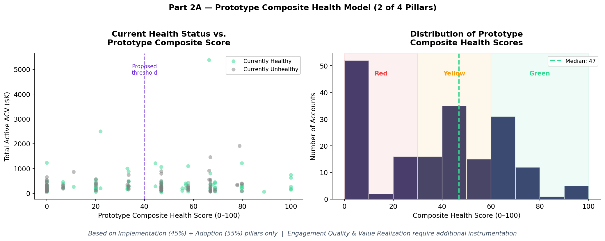

# CS Apps — Investment Decision Analysis

**Case Study: Senior Manager, Product Data Analyst — Contentsquare**

---

## Executive Summary

CS Apps shows strong revenue traction (+37% ACV, +30% accounts in 12 months) but faces a structural disconnect between selling and delivering value. Only 15% of accounts are currently live in production, 71% have zero certified users, and the health rate has declined from 63% to 54% in 10 months. $13.1M in renewal pipeline (37.9% of total) sits with unhealthy accounts, with a $16.3M Q4 cliff where 44% of UFR is at risk.

The health metric itself is unreliable — it uses platform-wide WAU (`AVG_WAU_GLOBAL`) rather than CS Apps-specific WAU, masking the true adoption problem.

**Recommendation: Increase investment — conditionally.**  The thesis is not "grow faster" but "fix the value delivery chain before the renewal cliff converts into churn."

> *CS Apps are creating value (revenue is growing) → but failing to deliver it (clients aren't going live or engaging) → which puts value protection at risk (renewals are deteriorating).*

---

## Context

CS Apps is Contentsquare's mobile application analytics product, extending CS Digital (web) to native iOS/Android apps. Capabilities include mobile heatmaps, session replay, journey analysis, and Zoning Analysis — all tagless. Clients commit to 24-month contracts. At renewal, procurement evaluates price, ROI, usage, legal, and compliance factors.

---

## Part 1 — Investment Decision: Stop / Maintain / Increase?

### 1.1 Problem Framing

The Product Director needs a data-driven recommendation for the CPO:

| Option | Description |
|---|---|
| **Stop** | Discontinue investment in CS Apps |
| **Maintain** | Keep current investment level |
| **Increase** | Accelerate investment and build a growth case |

### 1.2 Analytical Framework

The analysis is structured around three pillars that form a causal chain — each pillar feeds the next:

| Pillar | Core Question | Hypotheses |
|---|---|---|
| **Value Creation** | Is CS Apps generating and growing revenue? | H1 (Revenue & Growth), H7 (Segment Opportunity) |
| **Value Delivery** | Are clients reaching time-to-value, adopting, and engaging? | H4 (Implementation), H2 (Certification), H6 (Module Engagement) |
| **Value Protection** | Will this revenue renew or churn? | H3 (Health Decline), H5 (Renewal Pipeline), H8 (Health Formula Flaw) |

> **Reading this analysis:** If Value Creation is strong but Value Delivery is broken, then Value Protection will inevitably deteriorate. The investment decision depends on whether the delivery gap is fixable — and whether there is time to fix it before renewals hit.

### 1.3 Data Quality Audit

Before testing hypotheses, the data was audited for reliability.

**Findings:**

| Check | Result | Impact |
|---|---|---|
| Exact duplicate rows | 0 (Account), 0 (User) | No risk |
| Duplicate (Account, Month) keys | 0 | No ACV overcounting |
| Duplicate (User, Month, Module, Project) | 100 rows | Minor — 0.4% of user data |
| NULL `IMPLEMENTATION_STATUS_APPS` | 518 rows (28.7%) — 82 accounts | High — limits implementation analysis |
| NULL `CONTRACT_START_DATE` | 535 rows (29.7%) | Medium |
| NULL `CONTRACT_END_DATE` | 507 rows (28.1%) | Medium |
| NULL `USER_POSITION` | 2,089 rows (8.1%) | Medium |
| Rows with `AVG_WAU_GLOBAL` = 0 | 156 rows — 49 accounts | Critical for health metric |

**Note on UFR:** `TOTAL_UFR` is the total upcoming fiscal renewal value for an account in a given fiscal quarter. It is repeated for every month within that quarter. All UFR analyses in this document are deduplicated (one observation per account per fiscal quarter, latest month) to avoid overcounting.

> The PDF warns "if a client has multiple contracts, all the contracts will show up." Audit confirmed **0 duplicate (Account, Month) pairs** — no overcounting risk in ACV sums. The null pattern for implementation status is consistent across all months (~27–34%), indicating a systemic data pipeline issue, not a timing artifact.

---

## Pillar 1 — Value Creation (Revenue & Growth)

> *Is CS Apps generating and growing revenue meaningfully?*

### H1 — Revenue & Account Growth | INVEST

| Metric | Jan 2023 | Dec 2023 | Change |
|---|---|---|---|
| Total CS Apps ACV | $11.3M | $15.5M | **+37.4%** |
| Number of Accounts | 134 | 174 | **+29.9%** |
| Mean ACV per account | ~$84K | ~$89K | Stable |

Revenue is growing driven by new account acquisition, not price increases. The median ACV remains stable around $60K, suggesting consistent deal sizes with the growth coming from volume.

---

### H7 — High-Value Segment Opportunity | OPPORTUNITY

| Vertical | Accounts | Mean ACV | % Healthy |
|---|---|---|---|
| **Telco** | 13 | **$234K** | 52.9% |
| General Retailer | 47 | $92K | 59.7% |
| Energy/Utilities | 9 | $84K | 52.9% |
| Fashion | 18 | $59K | **73.0%** |

| Geo | Accounts | Mean ACV | % Healthy |
|---|---|---|---|
| **Americas** | 46 | **$113K** | 51.9% |
| APJ | 12 | $92K | 62.0% |
| EMEA | 127 | $74K | 62.0% |

Telco delivers 2.8x the average ACV but only 53% health. Americas is the highest-ACV geo but the least healthy (52%). Fashion, with lower ACV, leads with 73% health — suggesting a playbook problem, not a product problem.

**Pillar 1 verdict:** Value Creation is strong. CS Apps is selling well and growing. The problem is not demand — it's what happens after the sale.

---

## Pillar 2 — Value Delivery (Time to Value, Adoption & Engagement)

> *Are clients actually reaching go-live, using the product, and extracting value?*

### H4 — Implementation Bottleneck | CAUTION

Of 185 unique accounts, 53 (29%) have no implementation status tracked at all. The table below shows the **latest snapshot** — where each account stands as of its most recent month in the data. These are cross-sectional statuses, not cohort progressions through a funnel.

| Current Status | Accounts | % of Total (185) |
|---|---|---|
| NULL / Untracked | 53 | 29% |
| Not started | 8 | 4% |
| Started | 14 | 8% |
| Partially implemented | 18 | 10% |
| **Implemented** | **60** | **32%** |
| Partially lived | 5 | 3% |
| **Lived** | **27** | **15%** |

Only **27 accounts (15% of total base)** are currently in "Lived" status. The largest group — 60 accounts (32%) — sits at "Implemented" but has not gone live. Combined with 53 untracked accounts, **85% of CS Apps buyers are not actively using the product in production.** Of the 132 tracked accounts, 57 changed status at least once during 2023, indicating some movement — but not enough to materially shift the go-live rate.

---

### H2 — Certification & Adoption Gap | CAUTION

| Metric | CS Apps | CS Digital | Gap |
|---|---|---|---|
| Avg certified users per account | **0.69** | **18.1** | **26x** |
| Accounts with 0 certified users | **71.4%** (132/185) | — | — |
| Avg sessions per user per month | **2.84** | — | Low |

71% of accounts have zero certified CS Apps users. The same clients average 18 certified CS Digital users. Clients are buying but not embedding the product. The 2.84 avg sessions/user/month confirms shallow engagement.

---

### H6 — Shallow Module Engagement | CAUTION

| Module | % of Sessions | Avg Sessions/User | Note |
|---|---|---|---|
| **Homepage** | **25.7%** | 2.94 | Navigation, not value |
| Zoning Analysis | 18.2% | 3.81 | Core analytics |
| Journey Analysis | 11.3% | 2.76 | Core analytics |
| Workspace | 7.4% | **4.03** | High stickiness |
| Session Replay | 6.4% | 3.60 | Core analytics |
| Error Analysis | 0.6% | **4.36** | Highest stickiness, lowest reach |

1 in 4 sessions is on the Homepage. Users who reach Zoning, Workspace, or Error Analysis show higher engagement. This is a depth-of-usage problem: users land but don't navigate to the modules that deliver value.

**Pillar 2 verdict:** Value Delivery is the broken link. 85% of accounts are not live. Those that are live have almost no certified users and shallow engagement. The product is being sold but not delivered.

---

## Pillar 3 — Value Protection (Retention)

> *Will the revenue CS Apps has created survive renewal, or is it at risk of churn?*

### H3 — Declining Account Health | RISK

| Period | % Healthy | Trend |
|---|---|---|
| Jan 2023 | 56.0% | — |
| Feb–Jun 2023 (peak) | ~63.4% | Improving |
| Jul 2023 | 58.4% | Inflection point |
| Dec 2023 | **54.0%** | -9pp from peak |

Health peaked in Q1 and has declined continuously through H2. As the cohort grows, health is deteriorating — the product is adding accounts faster than it is making them successful.

**Key anomaly:** Accounts with "Not started" or "Started" implementation show *higher* health rates (67–71%) than "Lived" accounts (58%). This is explained by the health formula investigation (H8 below).

---

### H5 — Renewal Pipeline at Risk | HIGH RISK

| Fiscal Quarter | Total UFR | Renewing Accounts | % Accounts Healthy | % UFR Healthy |
|---|---|---|---|---|
| FQ 2022-11-01 | $5.0M | 20 | 60% | 57% |
| FQ 2023-02-01 | $2.8M | 16 | 62% | 58% |
| FQ 2023-05-01 | $5.1M | 23 | 87% | 88% |
| FQ 2023-08-01 | $5.4M | 17 | 59% | 62% |
| **FQ 2023-11-01** | **$16.3M** | **33** | **58%** | **56%** |

The Q4 pipeline is $16.3M with 33 renewing accounts, and only 56% of that UFR value is healthy. Across all quarters, **$13.1M of total UFR (37.9%) sits with unhealthy accounts.** The Q4 concentration ($16.3M = 47% of the full-year renewal pipeline) amplifies the risk.

---

### H8 — Health Metric Conflation | DATA QUALITY

The case study defines `HEALTHY_STATUS` as "a ratio between ACV and WAU (ACV/WAU)." Reverse-engineering the formula against the data:

| Status | Median ACV/WAU | Mean ACV/WAU |
|---|---|---|
| Healthy | **$22,311** | $32,961 |
| Unhealthy | **$71,667** | $132,522 |

**Lower ACV/WAU = Healthier.** The ratio represents cost-per-weekly-active-user. An account paying $100K with 50 WAU ($2K/user) is "healthy"; one paying $100K with 2 WAU ($50K/user) is "unhealthy." The best-fit threshold is **~$40,000 (87.9% accuracy).**

**The paradox explained:** Accounts with "Not started" CS Apps implementation still have their CS Digital WAU counted in `AVG_WAU_GLOBAL`. Their high Digital usage pushes ACV/WAU down, making them appear "healthy" — even though they derive zero value from CS Apps. The health metric conflates platform-wide engagement with product-specific value.

**Edge case:** 156 rows (8.7%) have `AVG_WAU_GLOBAL` = 0. Of these, 128 are "Unhealthy" (as expected — infinite $/user) and 28 are "Healthy" (unexplained without additional data).

> **Implication for the investment case:** The declining health rate (63% → 54%) may partially reflect a compositional effect — new accounts enter with high CS Digital WAU (appearing healthy) but as they adopt CS Apps and potentially reduce Digital usage, their WAU shifts and the ratio worsens. A CS Apps-specific health metric is needed to accurately assess product adoption.

**Pillar 3 verdict:** Value Protection is deteriorating. Health is declining, $13.1M in renewals is at risk, and the health metric itself is unreliable — meaning the true risk may be worse than reported.

---

## 1.6 Synthesis & Recommendation

> **Increase investment — conditionally.**

**The chain:**

| Pillar | Status | Summary |
|---|---|---|
| Value Creation | **Strong** | +37% ACV, +30% accounts — demand is real |
| Value Delivery | **Broken** | 85% not live, 71% zero certified users, shallow engagement |
| Value Protection | **Deteriorating** | Health declining, $13.1M at-risk UFR, flawed health metric |

**The situation in one sentence:** CS Apps is selling well but failing to convert sales into healthy, engaged accounts, and a $16.3M Q4 renewal cliff is approaching (44% of that UFR is unhealthy).

**Investment thesis:** Invest to fix the value delivery chain before Q4 renewals convert into churn.

**Priority actions:**

| # | Action | Pillar | Target | Rationale |
|---|---|---|---|---|
| 1 | **Accelerate implementation** | Delivery | "Lived" rate from 15% → 40%+ | 60 accounts (32%) stall at "Implemented"; 53 (29%) untracked |
| 2 | **Drive certification** | Delivery | 1 → 3+ certified users/account | 71% of accounts have 0 certified users |
| 3 | **In-product activation** | Delivery | Reduce Homepage share from 26% to 15% | Guide users to Zoning, Session Replay, Error Analysis |
| 4 | **Segment playbooks** | Creation | Telco & Americas | Highest ACV, worst health — benchmark against Fashion |
| 5 | **Rebuild health metric** | Protection | CS Apps-specific WAU | Current metric masks adoption failure with Digital usage |

---

### 1.7 Additional Data Needed

**Quantitative (not available in this dataset):**

- CS Apps-specific WAU (not global WAU) to compute a product-specific health score
- NPS / CSAT survey data per account
- Time-to-live (days from contract start to "Lived" status)
- Churn/renewal outcome data from prior cohorts
- Product usage funnel events (module visit sequences per user)
- CS Apps ACV as % of total contract at renewal

**Qualitative / Internal:**

- Customer success manager notes on blocked implementations
- Root cause for 29% of accounts missing implementation status
- Competitive context: what are clients using instead/alongside CS Apps?

**Market:**

- Competitor benchmarks (Mixpanel, Amplitude, UXCam, Heap for mobile)
- Mobile analytics adoption benchmarks by vertical

---

## Next Steps

- [x] Part 1 — Validate figures and finalize recommendations
- [x] Part 2 — Account Health redefinition for AI era (Sense Agent)
- [x] Part 2 — Monetization challenge: AI pricing model
- [ ] Deck — Build presentation structure (20-min restitution)

---

## Part 2 — The AI-First Transition

> *Part 1 proved that CS Apps is creating value but failing to deliver and protect it. Part 2 answers: how do we capture the extra value Sense delivers per session, and how do we measure health when analyst WAU stops being a reliable signal?*

---

## 2.1 The Monetization Challenge

### Recommendation

**Introduce daily Sense Analyst query quotas by tier (Quota + Tier model), with Sense Chat included free across all plans.** This captures AI value without replacing session-based pricing.

### The Problem: Uncaptured AI Value

Contentsquare prices on website visitor sessions (unchanged by Sense). But Sense increases value-per-session without capturing additional revenue. Clients get more insights from the same sessions — CS charges the same price.

> *The better Sense works, the more value clients extract — but Contentsquare's revenue stays flat.*

### How the Market Is Pricing AI Today

Five models dominate SaaS AI monetization, each with trade-offs:

| Model | How It Works | Companies | Verdict for CS |
|---|---|---|---|
| **Flat-Fee Add-On** | Fixed $/year for unlimited AI | Gainsight (Insight Agent add-on) | Simple but misaligned — leaves value on table |
| **Seat-Based** | Per-user/month, AI included | Pendo ($7K–$35K/yr by MAU tier) | Declining model — penalizes efficiency |
| **Usage / Token-Based** | Pay per AI query or token | PostHog (20% markup on LLM cost), Anthropic API (token-based) | Transparent but volatile for budgets |
| **Outcome-Based** | Pay per resolved outcome | Intercom Fin ($0.99/resolved ticket) | Hard in analytics — what's a "resolved insight"? |
| **Quota + Tier** | Daily/monthly cap per plan, upgrade for more | Anthropic Claude Pro (daily query cap + tier upgrades), Salesforce Agentforce | **Best fit — frequent friction drives upgrades** |

**Key findings:**

- Analytics competitors (Amplitude, Mixpanel, Heap) currently **bundle AI into tiers for free** as a differentiator. This works because their AI features are lightweight (chat assistants, basic summaries). When AI becomes the *primary interface* — as Sense Agent intends — bundling alone won't capture the value.
- **The Anthropic parallel is instructive:** Claude Pro users hit a daily usage cap and must either wait until the next day or upgrade to a higher tier. This creates frequent, low-friction upgrade pressure without fully blocking work — the user always gets access again tomorrow.

### Contentsquare Pricing: Current Model

Verified from [contentsquare.com/pricing](https://contentsquare.com/pricing/) (Experience Analytics product line):

| Tier | Price | Sessions | AI (Sense) |
|---|---|---|---|
| **Free** | €0 | 200K/month | Not listed |
| **Growth** | From €39/month | Starting at 7K | "Sense, Contentsquare's AI" (broadly included) |
| **Pro** | Custom | Starting at 1M | Same — no separate Sense tier visible |
| **Enterprise** | Custom | Starting at 1M | Same — plus Error summaries, Data feeds |

[Unverified] The public pricing page does not distinguish between Sense Chat and Sense Analyst. Whether advanced Sense capabilities are gated per tier behind the scenes is not visible from public information.

### Proposed Model: Daily Quota + Tier

| Tier | Sessions | Sense Chat | Sense Analyst Queries/Day |
|---|---|---|---|
| **Free** | 200K/month | Unlimited | Not included |
| **Growth** | Starting at 7K | Unlimited | 5/day |
| **Pro** | Starting at 1M | Unlimited | 25/day |
| **Enterprise** | Custom | Unlimited | Unlimited |

**How it works:** A Growth analyst runs 5 Sense Analyst queries in a day. The 6th is blocked with: *"Your team hit today's 5-query limit. Upgrade to Pro for 25/day, or cap resets tomorrow."* No work is lost — they wait or upgrade.

**Why daily:** Daily limits create frequent friction, driving natural upgrade conversations. Monthly limits create silence after early binge usage — weaker signal.

### Why This Model Wins

1. **Captures uncaptured value** — Revenue tied to AI usage, not just session volume.
2. **Preserves session pricing** — Sessions remain the base layer; Sense quota is additive.
3. **Simple to explain** — Global daily cap per tier is transparent and easy for procurement.
4. **Natural upgrade path** — Regular friction drives tier upgrades without blocking work.

### What the Data Says: One Analysis to Pick the Model

**The question:** Is usage evenly spread across accounts, or do some accounts use much more than others?

If usage is even → Flat-Fee works. If usage is uneven → Flat-Fee subsidizes heavy users. The distribution shape tells you which model fits.

**What we measured** (using analyst sessions/account/month as a proxy for future Sense Analyst usage):

| Metric | Value | What it means |
|---|---|---|
| Gini coefficient | **0.63** | High inequality — usage is very unevenly spread |
| Top 20% of accounts | **65% of all sessions** | A few heavy accounts dominate usage |
| P90 vs. median | **6x** | The heaviest users use 6x more than a typical account |
| Usage vs. health (correlation) | **r = 0.09, p = 0.33** | No significant link between usage and being a healthy account |

**How the data eliminates each model:**

| Model | Data test | Result |
|---|---|---|
| **Flat-Fee Add-On** | Is usage similar across accounts? | No — Gini 0.63. Heavy users would be subsidized. |
| **Success-Based Tier** | Does higher usage predict better health or renewal? | No — correlation is near zero and not significant. |
| **Credit-Based** | Is there clear cost variance across action types? | Cannot test — Sense query logs not yet available. Remains viable with more data. |
| **Quota + Tier** | Are there natural breakpoints in daily usage? | Yes — P50 = 0.7/day, P75 = 2.3/day, P90 = 4/day. Clear tier clusters exist. |

**Additional data that would sharpen the decision:**

| Data | What it would tell us |
|---|---|
| Sense query logs (type, cost, timestamp) | Whether different query types cost enough to justify credits |
| Query → action taken (export, share, implement) | Whether high usage correlates with outcomes — which would revive Success-Based |
| Renewal outcomes by usage tier | Whether heavy users actually renew at higher rates |

---

## 2.2 Redefining Account Health

### Recommendation

**Replace the single ACV/WAU ratio with a 4-pillar composite score** that measures value delivered — not human platform activity.

### Why the Current Metric Breaks

Part 1 proved two structural flaws. Sense Agent introduces a third:

1. **Conflation (H8):** `ACV / AVG_WAU_GLOBAL` uses platform-wide WAU. "Not started" CS Apps accounts appear healthy because CS Digital inflates the denominator.
2. **AI-driven WAU decline:** WAU measures **analysts logging into the platform weekly**. Sense Agent automates analysis that previously required manual sessions — one analyst with AI replaces several. WAU drops even for *successful, high-value* accounts. The metric classifies them as unhealthy.
3. **Pricing is unaffected, but health is:** Contentsquare prices on website visitor sessions (unchanged by Sense). But the health metric depends on analyst WAU, which Sense directly reduces. The pricing model and health model diverge.

> *Sense doesn't hurt revenue (session volume stays flat). It hurts the health score (analyst WAU drops). The metric will punish exactly the accounts where AI is working best.*

### Proposed: 4-Pillar Composite Score

| Pillar | Weight | What It Measures | Data Available Today? |
|---|---|---|---|
| **Implementation** | 20% | SDK integration, go-live status | Yes (IMPLEMENTATION_STATUS_APPS) |
| **Adoption** | 25% | Certified users, module breadth, user reach | Partial (certification + module data) |
| **Engagement Quality** | 30% | Core module depth + **Sense Analyst queries/day** | Requires Sense telemetry |
| **Value Realization** | 25% | Insights exported, dashboards built, NPS | Requires new instrumentation |

**Design principle:** Every pillar should *improve* (or stay stable) as AI adoption increases. If Sense replaces manual sessions but increases insights consumed and queries run, the score should go up — not down. Sense queries/day (from the daily-quota model in 2.1) becomes a direct input to the Engagement Quality pillar.

### Implementation Roadmap

| Phase | Timeline | Action |
|---|---|---|
| **Instrument** | Months 1–2 | Add CS Apps-specific WAU; instrument Sense query telemetry |
| **Prototype** | Months 2–3 | Build composite score with available pillars; backtest against churn |
| **Validate** | Months 3–4 | Compare predictive power vs. current ACV/WAU |
| **Deploy** | Months 5–6 | Replace metric in dashboards; train CS team |

**Critical dependency:** Validation requires historical churn/renewal outcome data not in this dataset.

---

## Part 2 — Synthesis

> *The pricing model and health metric face different but connected problems. Pricing misses the extra value Sense delivers per session. Health punishes accounts where Sense is working — because analyst WAU drops. The daily-quota model solves pricing by capturing AI value as a new revenue layer. The composite health score solves measurement by replacing declining WAU with Sense query activity. Together, they realign the business around AI-delivered value.*

---

## Next Steps

- [x] Part 1 — Validate figures and finalize recommendations
- [x] Part 2 — Account Health redefinition for AI era (Sense Agent)
- [x] Part 2 — Monetization challenge: AI pricing model
- [ ] Deck — Build presentation structure (20-min restitution)

---

