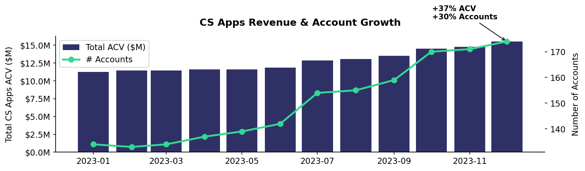
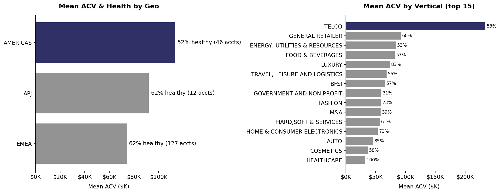
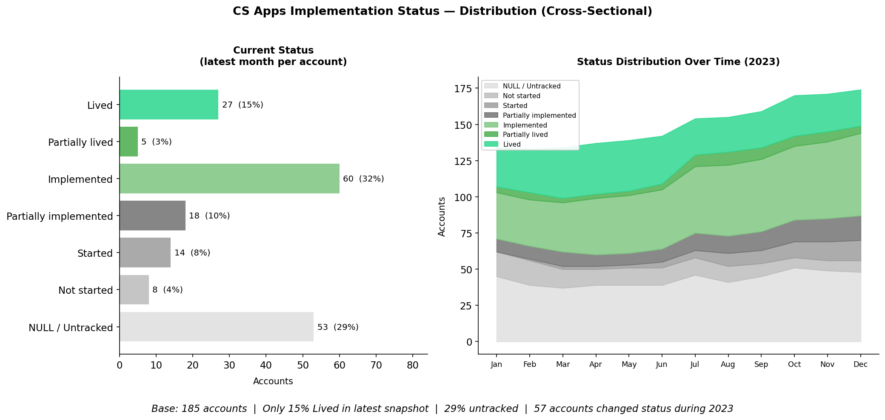
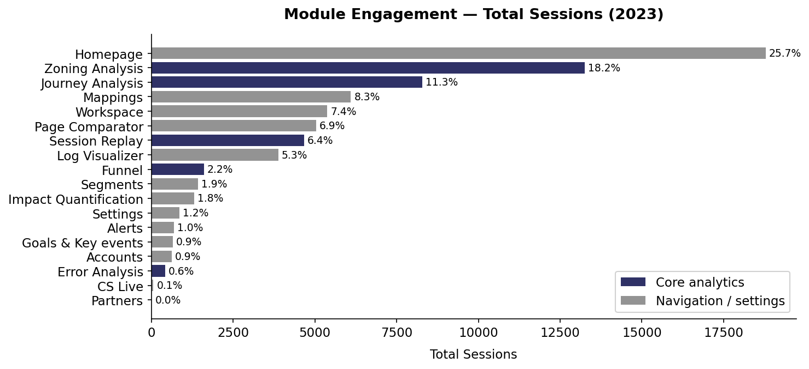
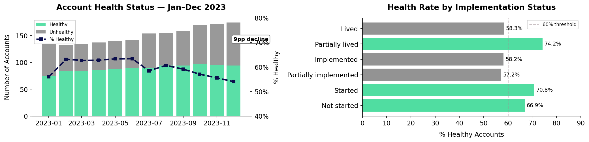
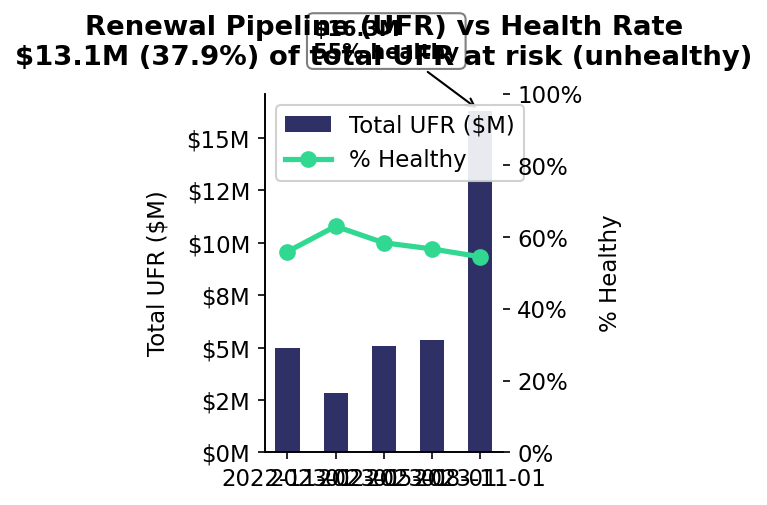
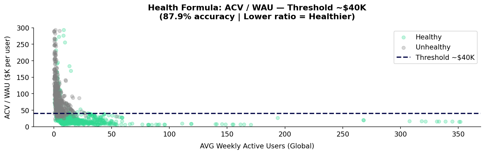
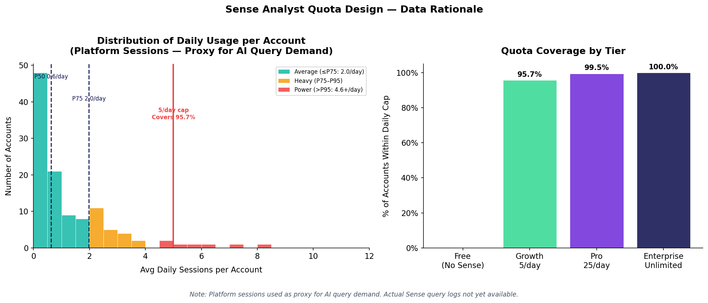

# CS Apps — Investment Decision Analysis

**Case Study: Senior Manager, Product Data Analyst — Contentsquare**

---

## Executive Summary

CS Apps shows strong revenue traction (+37% ACV, +30% accounts in 12 months) but faces a structural disconnect between selling, adopting, and delivering value. Only 15% of accounts are currently live in production, 71% have zero certified users, and the current health metric is unreliable: it mixes CS Digital usage into CS Apps scores, making non-users appear healthy. The real retention risk is not active churn from dissatisfied users. It is renewal refusal from non-users who will have no ROI evidence when Q4 contracts come up. $16.3M renews in Q4 across 33 accounts.

**Recommendation: Increase investment — conditionally.** The thesis is not "grow faster" but "implement now, before 33 accounts reach renewal with nothing to show for CS Apps."

> *CS Apps are creating value (revenue is growing) → but failing to deliver it (clients aren't going live or engaging) → creating a latent renewal risk: non-adopters face procurement conversations with no ROI evidence, and the metric that was supposed to catch this is broken.*

---

## Context

CS Apps is Contentsquare's mobile application analytics product, extending CS Digital (web) to native iOS/Android apps. Capabilities include mobile heatmaps, session replay, journey analysis, and Zoning Analysis — all tagless. Clients commit to 24-month contracts. At renewal, procurement evaluates price, ROI, usage, legal, and compliance factors.

---

## Part 1 — Investment Decision: Stop / Maintain / Increase?

### 1.1 Problem Framing

The Product Director needs a data-driven recommendation for the CPO:

- **Stop**: Discontinue investment in CS Apps
- **Maintain**: Keep current investment level
- **Increase**: Accelerate investment and build a growth case

### 1.2 Analytical Framework

The analysis is structured around three pillars that form a causal chain — each pillar feeds the next:

| Pillar | Core Question | Status | Summary |
|---|---|---|---|
| **Value Creation** (Acquisition & Growth) | Is CS Apps generating and growing revenue? | **Strong** | +37% ACV, +30% accounts — demand is real |
| **Value Delivery** (Adoption & Engagement) | Are clients reaching time-to-value, adopting, and engaging? | **Broken** | 85% not live, 71% zero certified users, shallow engagement |
| **Value Protection** (Retention & ARR) | Will this revenue renew or churn? | **At Risk** | Health metric is unreliable. The real risk: 33 accounts renewing $16.3M in Q4 with no Apps adoption to justify the spend |

> **Reading this analysis:** If Value Creation is strong but Value Delivery is broken, then Value Protection will inevitably deteriorate. The investment decision depends on whether the delivery gap is fixable — and whether there is time to fix it before renewals hit.

---

## Pillar 1 — Value Creation (Revenue & Growth)

> *Is CS Apps generating and growing revenue meaningfully — and is it deepening its position within each client's total Contentsquare relationship?*

### Data Scope Note

This dataset covers **only accounts with active CS Apps contracts**. `TOTAL_ACTIVE_ACV` for each account represents their full Contentsquare spend (CS Apps + CS Digital + other add-ons). We do not know how many CS Digital-only accounts exist — the dataset does not include them. The analysis below cannot measure CS Apps' market penetration across all CS clients. What it **can** measure is **wallet penetration**: how large a share of each account's total Contentsquare spend is CS Apps — and whether that share is growing.

---

### H1 — Revenue & Account Growth | INVEST

| Metric | Jan 2023 | Dec 2023 | Change |
|---|---|---|---|
| Total CS Apps ACV | $11.3M | $15.5M | **+37%** |
| Total relationship ACV (all products) | $48.7M | $62.9M | +29% |
| Number of accounts | 134 | 174 | **+30%** |
| Mean CS Apps ACV per account | ~$84K | ~$89K | Stable |
| **CS Apps penetration (Apps / Total ACV)** | **23.1%** | **24.6%** | **+1.5pp** |

CS Apps ACV is growing faster than total relationship ACV (+37% vs. +29%). This means CS Apps is increasing its share of the Contentsquare wallet — penetration grew from 23.1% to 24.6% over the year.



---

### H1b — Wallet Penetration Trend (Jan → Dec 2023)

Penetration = CS Apps ACV / Total Contentsquare ACV for the same accounts.

| Month | CS Apps ACV | Total ACV | CS Apps Penetration |
|---|---|---|---|
| Jan 2023 | $11.26M | $48.69M | 23.1% |
| Feb 2023 | $11.46M | $48.39M | 23.7% |
| Mar 2023 | $11.45M | $48.53M | 23.6% |
| Apr 2023 | $11.58M | $49.51M | 23.4% |
| May 2023 | $11.59M | $50.54M | 22.9% |
| Jun 2023 | $11.84M | $51.65M | 22.9% |
| Jul 2023 | $12.87M | $56.28M | 22.9% |
| Aug 2023 | $13.07M | $56.78M | 23.0% |
| Sep 2023 | $13.51M | $57.24M | 23.6% |
| Oct 2023 | $14.51M | $59.80M | 24.3% |
| Nov 2023 | $14.77M | $60.38M | 24.5% |
| **Dec 2023** | **$15.48M** | **$62.88M** | **24.6%** |

**Reading:** Penetration dips mid-year (May–Jul) as new accounts enter with large CS Digital contracts — the total relationship grows faster than CS Apps ACV temporarily. By H2, CS Apps recovers and outpaces total growth. The direction is positive but the rate of penetration gain is modest (+1.5pp in 12 months). CS Apps still represents roughly 1 in 4 dollars of these clients' Contentsquare spend.

---

### H7 — Wallet Penetration by Segment | OPPORTUNITY

The segment tables below show two dimensions: CS Apps ACV (what we're billing for Apps) and the total Contentsquare relationship (the full stake at risk). **CS Apps % of relationship** = wallet penetration per segment.

**By Vertical (Dec 2023):**

| Vertical | Accounts | Mean CS Apps ACV | Mean Total ACV | CS Apps % | % Healthy |
|---|---|---|---|---|---|
| Telco | 10 | $272K | $940K | **29%** | 50% |
| Energy, Util & Resources | 8 | $100K | $275K | **36%** | 25% |
| General Retailer | 46 | $96K | $392K | 24% | 46% |
| BFSI | 26 | $92K | $298K | 31% | 58% |
| **Luxury** | **2** | **$90K** | **$1,369K** | **7%** | 100% |
| Food & Beverages | 14 | $82K | $262K | 31% | 57% |
| M&A | 8 | $65K | $330K | 20% | 50% |
| Travel, Leisure & Logistics | 15 | $62K | $237K | 26% | 67% |

**By Geo (Dec 2023):**

| Geo | Accounts | Mean CS Apps ACV | Mean Total ACV | CS Apps % | % Healthy |
|---|---|---|---|---|---|
| Americas | 42 | $115K | $530K | **22%** | 43% |
| EMEA | 121 | $76K | $319K | 24% | 57% |
| APJ | 11 | $129K | $206K | **63%** | 64% |

**What this reveals:**

- **Luxury:** The outlier. $1.37M mean total relationship but only 7% is CS Apps ($90K). Two accounts — but if CS Apps ever delivers value here and expands, each account has 13× the upsell room of a typical account. The 100% health rate is not meaningful with n=2.
- **Telco:** $940K mean total relationship, 29% penetration, 50% health. A failing Telco CS Apps account is a risk to the full $940K — not just the $272K Apps line. These accounts warrant dedicated intervention.
- **Americas:** Only 22% penetration despite the highest total relationship ($530K/account). CS Apps is under-represented in the geo with the most value at stake. Lowest health (43%).
- **APJ:** 63% penetration — Apps is proportionally dominant in these accounts. They have far less CS Digital relative to Apps compared to other geos. Smaller total relationships but Apps is central.
- **Energy:** 36% penetration but 25% health — highest penetration risk outside APJ.

The segment view reframes the strategic question: **which accounts have the most total relationship value where CS Apps penetration is low and health is poor?** Those are the accounts where adoption failure threatens the whole Contentsquare relationship, not just the CS Apps line.



---

**Pillar 1 verdict:** CS Apps is growing and increasing wallet penetration (+1.5pp in 2023). But at 24.6% mean penetration, CS Apps still represents a minority of each client's Contentsquare spend. The acquisition story is not just volume (+30% accounts) — it's deepening position within high-value accounts. The adoption failure documented in Pillar 2 is not just a CS Apps problem: it puts the full Contentsquare relationship at risk. In segments like Telco ($940K total, 29% Apps) and Americas ($530K total, 22% Apps), a failed renewal conversation touches the entire account, not a line item.

---

## Pillar 2 — Value Delivery (Time to Value, Adoption & Engagement)

> *Are clients actually reaching go-live, using the product, and extracting value?*

### H4 — Implementation Bottleneck | CAUTION

Of 185 unique accounts, 53 (29%) have no implementation status tracked at all. The table below shows the **latest snapshot** — where each account stands as of its most recent month in the data.

| Current Status | Accounts | % of Total (185) |
|---|---|---|
| NULL / Untracked | 53 | 29% |
| Not started | 8 | 4% |
| Started | 14 | 8% |
| Partially implemented | 18 | 10% |
| **Implemented** | **60** | **32%** |
| Partially lived | 5 | 3% |
| **Lived** | **27** | **15%** |

Only **27 accounts (15% of total base)** are currently in "Lived" status. The largest group — 60 accounts (32%) — sits at "Implemented" but has not gone live. **85% of CS Apps buyers are not actively using the product in production.**



---

### H2 — Certification & Adoption Gap | CAUTION

| Metric | CS Apps | CS Digital | Gap |
|---|---|---|---|
| Avg certified users per account | **0.69** | **18.1** | **26x** |
| Accounts with 0 certified users | **71.4%** (132/185) | — | — |
| Avg sessions per user per month | **2.84** | — | Low |

71% of accounts have zero certified CS Apps users. The same clients average 18 certified CS Digital users. Clients are buying but not embedding the product.


---

### H6 — Shallow Module Engagement | CAUTION

| Module | % of Sessions | Avg Sessions/User | Note |
|---|---|---|---|
| **Homepage** | **25.7%** | 2.94 | Navigation, not value |
| Zoning Analysis | 18.2% | 3.81 | Core analytics |
| Journey Analysis | 11.3% | 2.76 | Core analytics |
| Workspace | 7.4% | **4.03** | High stickiness |
| Session Replay | 6.4% | 3.60 | Core analytics |
| Error Analysis | 0.6% | **4.36** | Highest stickiness, lowest reach |

1 in 4 sessions is on the Homepage. Users who reach Zoning, Workspace, or Error Analysis show higher engagement. This is a depth-of-usage problem.



**Pillar 2 verdict:** Value Delivery is the broken link. 85% of accounts are not live. Those that are live have almost no certified users and shallow engagement.

---

## Pillar 3 — Value Protection (Retention)

> *Will the revenue CS Apps has created survive renewal, or is it at risk of churn?*

### H3 — Declining Account Health | RISK

| Period | % Healthy | Trend |
|---|---|---|
| Jan 2023 | 56.0% | — |
| Feb–Jun 2023 (peak) | ~63.4% | Improving |
| Jul 2023 | 58.4% | Inflection point |
| Dec 2023 | **54.0%** | -9pp from peak |

Health peaked in Q1 and has declined continuously through H2. The product is adding accounts faster than it is making them successful.



**Key anomaly:** Accounts with "Not started" or "Started" implementation show *higher* health rates (67–71%) than "Lived" accounts (58%). This is explained by the health formula investigation (H8 below).

This anomaly is not a coincidence. It exposes the core flaw: the health metric cannot distinguish between a healthy CS Apps account and an account that happens to have strong CS Digital usage. Any health trend derived from this metric is untrustworthy. The 63% to 54% decline could reflect genuine Apps deterioration, dilution from 30% more new accounts entering the base pre-live, or shifts in Digital usage unrelated to Apps entirely.

---

### H5 — Renewal Pipeline at Risk | HIGH RISK

| Fiscal Quarter | Total UFR | Renewing Accounts | % Accounts Healthy | % UFR Healthy |
|---|---|---|---|---|
| FQ 2022-11-01 | $5.0M | 20 | 60% | 57% |
| FQ 2023-02-01 | $2.8M | 16 | 62% | 58% |
| FQ 2023-05-01 | $5.1M | 23 | 87% | 88% |
| FQ 2023-08-01 | $5.4M | 17 | 59% | 62% |
| **FQ 2023-11-01** | **$16.3M** | **33** | **58%** | **56%** |

**$13.1M of total UFR (37.9%) sits with unhealthy accounts.** The Q4 concentration ($16.3M = 47% of the full-year renewal pipeline) amplifies the risk.

Note: the $13.1M figure is derived from the same unreliable health metric. Some accounts classified as unhealthy may be misclassified. The metric should not be used as the sole basis for risk segmentation until the health formula is corrected.

Data note: the account dataset contains 174 unique accounts in December 2023, while the implementation data references 185 unique accounts. The 11-account gap is unexplained. It may indicate accounts that churned out of the active base but remain in historical user or implementation records. This is an additional data quality issue that should be investigated.



---

### H8 — Health Metric Conflation | DATA QUALITY

| Status | Median ACV/WAU | Mean ACV/WAU |
|---|---|---|
| Healthy | **$22,311** | $32,961 |
| Unhealthy | **$71,667** | $132,522 |

**Lower ACV/WAU = Healthier.** The ratio represents cost-per-weekly-active-user. The best-fit threshold is ~$40,000 (87.9% accuracy).

**The paradox explained:** Accounts with "Not started" CS Apps implementation still have their CS Digital WAU counted in `AVG_WAU_GLOBAL`. Their high Digital usage pushes ACV/WAU down, making them appear "healthy" — even though they derive zero value from CS Apps.



**Pillar 3 verdict:** The current health metric is not a reliable measure of retention risk. The accurate framing is this: the retention problem is latent, not active. Accounts are likely renewing today because CS Apps is bundled with CS Digital. The real cliff arrives when procurement asks "what did we get from CS Apps?" and 85% of accounts have no answer. The Q4 cohort ($16.3M, 33 accounts) is the intervention target, not a lagging indicator of health decline.

---

**Priority actions:**

| # | Action | Pillar | Target | Rationale |
|---|---|---|---|---|
| 1 | **Accelerate implementation** | Delivery | "Lived" rate from 15% → 40%+ | 60 accounts stall at "Implemented"; 53 untracked |
| 2 | **Drive certification** | Delivery | 1 → 3+ certified users/account | 71% of accounts have 0 certified users |
| 3 | **In-product activation** | Delivery | Reduce Homepage share from 26% to 15% | Guide users to Zoning, Session Replay, Error Analysis |
| 4 | **Segment playbooks** | Creation | Telco & Americas | Highest ACV, worst health — benchmark against Fashion |
| 5 | **Rebuild health metric** | Protection | CS Apps-specific WAU | Current metric masks adoption failure with Digital usage |

### 1.3 Data Quality Audit

Before testing hypotheses, the data was audited for reliability.

**Findings:**

| Check | Result | Impact |
|---|---|---|
| Exact duplicate rows | 0 (Account), 0 (User) | No risk |
| Duplicate (Account, Month) keys | 0 | No ACV overcounting |
| Duplicate (User, Month, Module, Project) | 100 rows | Minor — 0.4% of user data |
| NULL `IMPLEMENTATION_STATUS_APPS` | 518 rows (28.7%) — 82 accounts | High — limits implementation analysis |
| NULL `CONTRACT_START_DATE` | 535 rows (29.7%) | Medium |
| NULL `CONTRACT_END_DATE` | 507 rows (28.1%) | Medium |
| NULL `USER_POSITION` | 2,089 rows (8.1%) | Medium |
| Rows with `AVG_WAU_GLOBAL` = 0 | 156 rows — 49 accounts | Critical for health metric |

**Note on UFR:** `TOTAL_UFR` is the total upcoming fiscal renewal value for an account in a given fiscal quarter. It is repeated for every month within that quarter. All UFR analyses in this document are deduplicated (one observation per account per fiscal quarter, latest month) to avoid overcounting.

> The PDF warns "if a client has multiple contracts, all the contracts will show up." Audit confirmed **0 duplicate (Account, Month) pairs** — no overcounting risk in ACV sums. The null pattern for implementation status is consistent across all months (~27–34%), indicating a systemic data pipeline issue, not a timing artifact.

---

## Part 2 — The AI-First Transition

> *Part 1 proved that CS Apps is creating value but failing to deliver and protect it. Part 2 answers: how do we capture the extra value Sense delivers per session, and how do we measure health when analyst WAU stops being a reliable signal?*

---

## 2.1 The Monetization Challenge

### Recommendation

Introduce daily Sense Analyst query quotas by tier **(Quota + Tier model), with Sense Chat included free across all plans.** This captures AI value without replacing session-based pricing.

### The Problem: Uncaptured AI Value

Contentsquare prices on website visitor sessions (unchanged by Sense). But Sense increases value-per-session without capturing additional revenue. Clients get more insights from the same sessions — CS charges the same price.

> *The better Sense works, the more value clients extract — but Contentsquare's revenue stays flat.*

### How the Market Is Pricing AI Today

| Model | How It Works | Companies | Verdict for CS |
|---|---|---|---|
| **Flat-Fee Add-On** | Fixed $/year for unlimited AI | Gainsight (Insight Agent add-on) | Simple but misaligned — leaves value on table |
| **Usage / Token-Based** | Pay per AI query or token | PostHog, Anthropic API (token-based) | Transparent but volatile for budgets |
| **Outcome-Based** | Pay per resolved outcome | Intercom Fin ($0.99/resolved ticket) | Hard in analytics |
| **Quota + Tier** | Daily/monthly cap per plan, upgrade for more | Anthropic Claude Pro, Salesforce Agentforce | **Best fit — frequent friction drives upgrades** |

**Key findings:**

- Analytics competitors (Amplitude, Mixpanel, Heap) currently **bundle AI into tiers for free**. This works because their AI features are lightweight. When AI becomes the primary interface (as Sense Agent intends) bundling alone won't capture the value.
- **The Anthropic parallel is instructive:** Claude Pro users hit a daily usage cap and must either wait until the next day or upgrade to a higher tier. This creates frequent, low-friction upgrade pressure without fully blocking work.

### Contentsquare Pricing: Current Model

Verified from [contentsquare.com/pricing](http://contentsquare.com/pricing) (Experience Analytics product line):

| Tier | Price | Sessions | AI (Sense) |
|---|---|---|---|
| **Free** | €0 | 200K/month | Not listed |
| **Growth** | From €39/month | Starting at 7K | Included |
| **Pro** | Custom | Starting at 1M | Included |
| **Enterprise** | Custom | Starting at 1M | Included + Error summaries, Data feeds |

### Proposed Model: Daily Quota + Tier

| Tier | Sessions | Sense Chat | Sense Analyst Queries/Day |
|---|---|---|---|
| **Free** | 200K/month | Unlimited | Not included |
| **Growth** | Starting at 7K | Unlimited | 5/day \* |
| **Pro** | Starting at 1M | Unlimited | 25/day |
| **Enterprise** | Custom | Unlimited | Unlimited |

**How it works:** A Growth analyst runs 5 Sense Analyst queries in a day. The 6th is blocked with: *"Your team hit today's 5-query limit. Upgrade to Pro for 25/day, or cap resets tomorrow."* No work is lost, they wait or upgrade.

\*Why 5/day?: In average, the customer have 3 sessions daily, if this



### Why This Model Wins

1. **Captures uncaptured value** — Revenue tied to AI usage, not just session volume.
2. **Preserves session pricing** — Sessions remain the base layer; Sense quota is additive.
3. **Simple to explain** — Global daily cap per tier is transparent and easy for procurement.
4. **Natural upgrade path** — Regular friction drives tier upgrades without blocking work.

### What the Data Says: One Analysis to Pick the Model

**The question:** Is usage evenly spread across accounts, or concentrated among a few?

| Metric | Value | What it means |
|---|---|---|
| Top 20% of accounts | **65% of all sessions** | A few heavy accounts dominate usage |
| P90 vs. median | **6x** | Heavy users use 6x more than a typical account |
| Usage vs. health correlation | **r = 0.09, p = 0.33** | No link between high usage and account health |


**How the data picks the model:**

| Model | What the data says | Verdict |
|---|---|---|
| **Flat-Fee Add-On** | Usage is too concentrated (top 20% = 65%). Heavy users would be subsidized. | Eliminated |
| **Success-Based Tier** | No correlation between usage and health. Can't prove usage drives outcomes. | Eliminated |
| **Credit-Based** | Cannot test — Sense query logs not available yet. | Needs more data |
| **Quota + Tier** | Natural daily breakpoints exist (P50 = 0.7, P75 = 2.3, P90 = 4 queries/day). | **Confirmed** |

**Additional data that would sharpen the decision:**

| Data | What it would tell us |
|---|---|
| Sense query logs (type, cost, timestamp) | Whether different query types cost enough to justify credits |
| Query → action taken (export, share) | Whether usage correlates with outcomes — would revive Success-Based |
| Renewal outcomes by usage tier | Whether heavy users actually renew at higher rates |

---

## 2.2 Redefining Account Health for the AI Era

### Formula

**If Non-Live / Partially Live:**

```
Score = (0.15 × P1) + (0.25 × P2) + (0.60 × P3)
```

**If Live:**

```
Score = (0.3 × P2) + (0.7 × P3)
```

**Healthy = Score ≥ 50**

---

### Pillars

**P1 — Implementation Velocity** *(Non-Live only. Dropped once account goes Live.)*

- Score = 100 if within expected implementation window
- Decreases linearly beyond the window

**P2 — Adoption (ACV-Normalized)**

```
P2 = min( Certified Users / (ACV × α) , 1 ) × 100
```

Normalizes adoption against account size. A $500K account requires proportionally more certified users than a $50K account.

**P3 — Engagement Quality (AI-Aware)**

```
P3 = max( 0 , 100 − ACV / (WAU + Sense Queries/week) × β )
```

Replaces WAU-only metric with (WAU + Sense Queries/week) to avoid penalizing accounts migrating activity to AI. ACV remains the commercial anchor.

---

### Illustrative Examples (Dummy Data)

*Assumed constants: α = 1/100,000 · β = 1/500 · Expected implementation window = 90 days*

| Account | ACV | Status | Impl Days | WAU | Sense Q/wk | Cert Users | P1 | P2 | P3 | Score |
|---|---|---|---|---|---|---|---|---|---|---|
| A — Acme Corp | $200K | Non-Live | 210 | 2 | 0 | 1 | 0 | 50 | 0 | **15 ⚠** |
| B — Beta Co | $400K | Live | — | 10 | 5 | 1 | — | 25 | 47 | **39 ⚠** |
| C — Gamma Inc | $200K | Live | — | 20 | 10 | 5 | — | 100 | 87 | **92 ✓** |
| D — Delta SA | $500K | Live | — | 3 | 2 | 6 | — | 100 | 0 | **38 ⚠** |
| E — Echo Ltd | $120K | Non-Live | 75 | 3 | 1 | 2 | 85 | 100 | 40 | **67 ✓** |

**What each case illustrates: (not included in ppt)**

- **A**: 2.3× past the expected implementation window. P1 collapses to 0, dragging total score to 15 despite moderate adoption. Escalation warranted.
- **B**: Live and engaged (P3=47), but a single certified user for a $400K account is critically under-adopted. P2=25 flags the gap.
- **C**: All pillars healthy. Strong adoption, high AI + web engagement relative to ACV. Model correctly scores this as 92.
- **D**: Large account with certified users in place (P2=100), but near-zero platform and AI usage. ACV/(WAU+Q) = 100K — same ratio as Account A. P3 collapses to 0. High churn risk despite adoption score.
- **E**: Non-live but on track (day 75 of 90). Sandbox engagement already visible. Borderline-healthy score shows the implementation is progressing normally.

---

### Data Required to Validate

| Input | Current Estimate | Needed To Calibrate |
|---|---|---|
| **α** — adoption rate per $ ACV | 1/100,000 | Distribution of (Cert Users / ACV) across live accounts |
| **β** — engagement sensitivity | 1/500 | Distribution of ACV / (WAU + Sense Q) ratios; calibrate so P50 account scores ~50 |
| Break-even ratio (P3 = 50) | ~$25K ACV per (WAU+Q) | Recalibrate once Sense query telemetry is available |
| Expected implementation window | TBD | Historical time-to-go-live by account tier |
| Sense Queries/week | **Not yet available** | Requires Sense query logs at account level — currently proxied by platform sessions |

> **Note on break-even shift:** The old $40K threshold (derived from ACV/WAU alone) is no longer valid. Adding query volume to the denominator increases it, reducing the ratio. The new break-even must be recalibrated from real Sense query data. $25K is an estimate only.

---

## Next Steps

- [x] Part 1 — Validate figures and finalize recommendations
- [x] Part 2 — Account Health redefinition for AI era (Sense Agent)
- [x] Part 2 — Monetization challenge: AI pricing model
- [ ] Deck — Build presentation structure (20-min restitution)
