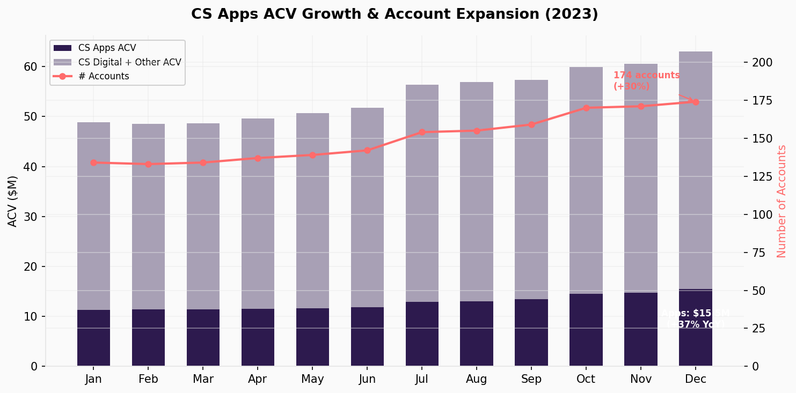
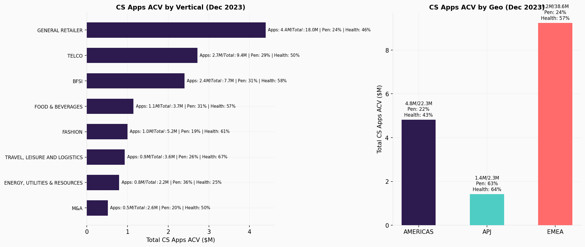
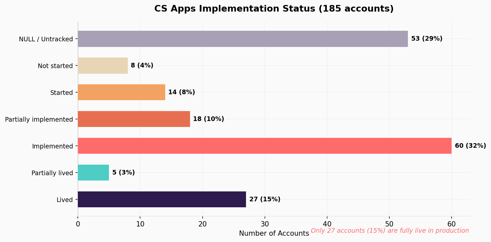
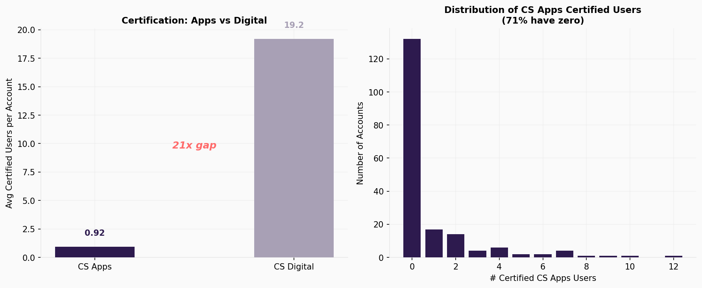
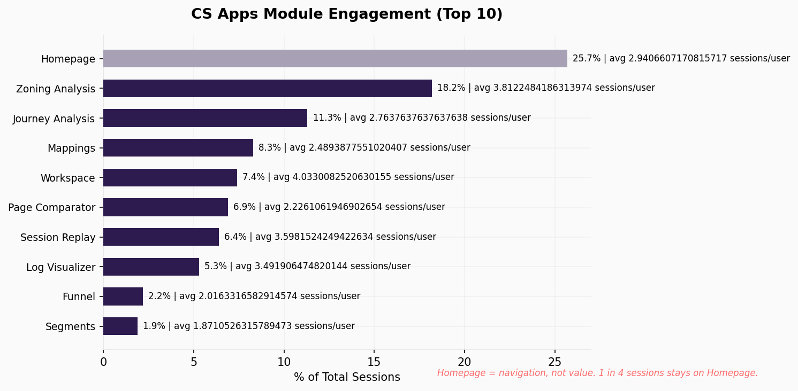
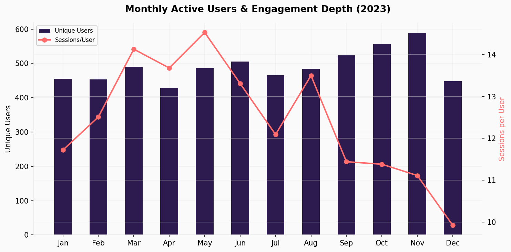
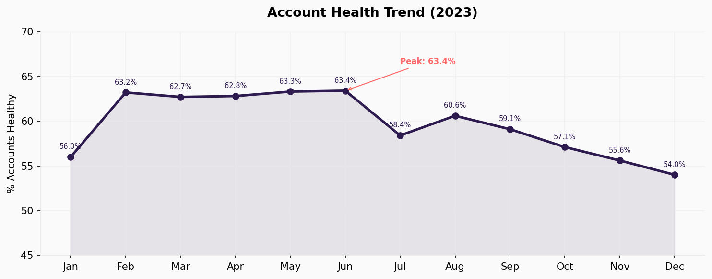
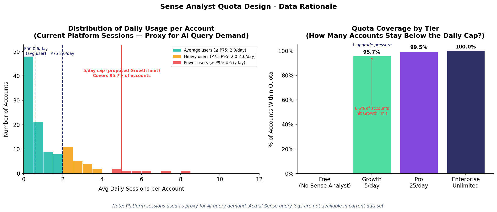
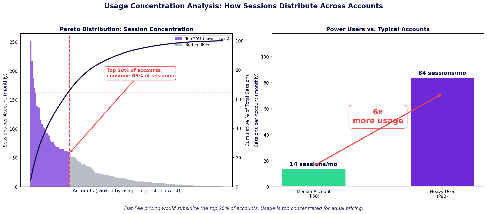

# CS Apps — Investment Decision Analysis

**Case Study: Senior Manager, Product Data Analyst — Contentsquare**

---

## Executive Summary

CS Apps shows strong revenue traction (+37% ACV growth, +30% accounts in 12 months) but faces a structural disconnect between selling and delivering value. Only 15% of accounts are currently live in production, 71% have zero certified CS Apps users, and the current health metric is unreliable — it uses total ACV and global WAU (including CS Digital activity), making non-Apps-users appear healthy. The real retention risk is not active churn from dissatisfied users but renewal refusal from non-adopters who will have no ROI evidence when contracts come up. $16.0M renews in Q4 FY2023 across 31 accounts.

**Recommendation: Increase investment — conditionally.** The priority is not "grow faster" but "implement now, before renewal-exposed accounts reach procurement conversations with nothing to show for CS Apps."

---

## Context

CS Apps is Contentsquare's mobile application analytics product, extending CS Digital (web) to native iOS/Android apps. The dataset covers **only accounts with active CS Apps contracts**. Key column definitions:

- **TOTAL_ACTIVE_ACV**: Full Contentsquare spend — CS Digital + CS Apps + other add-ons
- **ACV_CS_APPS**: Annual contract value for the CS Apps product specifically
- **CS Digital ACV** (derived): TOTAL_ACTIVE_ACV − ACV_CS_APPS
- **TOTAL_UFR**: Up-for-renewal value; repeated for every month within a fiscal quarter — deduplicated to one row per account-quarter

Clients commit to 24-month contracts. At renewal, procurement evaluates price, ROI, usage, legal, and compliance factors.

---

## Part 1 — Investment Decision: Stop / Maintain / Increase?

### 1.1 Problem Framing

The Product Director needs a data-driven recommendation for the CPO: stop, maintain, or increase investment in CS Apps.

### 1.2 Analytical Framework

The analysis is structured around three pillars that form a causal chain:

| Pillar | Core Question | Status | Summary |
|---|---|---|---|
| **Value Creation** (Revenue & Growth) | Is CS Apps generating and growing revenue? | **Strong** | +37% Apps ACV, +30% accounts, penetration rising |
| **Value Delivery** (Adoption & Engagement) | Are clients reaching time-to-value? | **Broken** | 85% not live, 71% zero certified users, shallow engagement |
| **Value Protection** (Retention & Health) | Will this revenue survive renewal? | **At Risk** | Health metric unreliable; $16.0M renewing in Q4 with 31 accounts |

### 1.3 Data Quality Audit

| Check | Result | Impact |
|---|---|---|
| Exact duplicate rows | 0 (Account), 0 (User) | No risk |
| Duplicate (Account, Month) keys | 0 | No ACV overcounting |
| Duplicate (User, Month, Module, Project) | 100 rows | Minor — 0.4% of user data |
| NULL `IMPLEMENTATION_STATUS_APPS` | 518 rows (28.7%) | High — limits implementation analysis |
| Rows with `AVG_WAU_GLOBAL` = 0 | 156 rows — 49 accounts | Critical for health metric |
| Rows with `ACV_CS_APPS` = 0 | 76 rows — 9 accounts | Monitor — accounts with zero Apps billing |

**Note on UFR:** `TOTAL_UFR` is repeated for every month within a fiscal quarter (up to 3× per account-quarter). All UFR analyses use **one row per account per fiscal quarter** (last month) to avoid overcounting. Without deduplication, naive sums inflate UFR by 2–3×.

**Note on (Account, Month) keys:** Audit confirmed 0 duplicates — no overcounting risk in ACV sums.

---

## Pillar 1 — Value Creation (Revenue & Growth)

> *Is CS Apps generating and growing revenue — and is it deepening its position within each client's total Contentsquare relationship?*

### Data Scope

This dataset covers only accounts with active CS Apps contracts. We cannot measure CS Apps' market penetration across all CS Digital clients. What we **can** measure is **wallet penetration**: what share of each account's total Contentsquare spend is CS Apps, and whether that share is growing.

---

### H1 — Revenue & Account Growth

| Metric | Jan 2023 | Dec 2023 | Change |
|---|---|---|---|
| CS Apps ACV (`ACV_CS_APPS`) | $11.26M | $15.48M | **+37%** |
| Total relationship ACV (`TOTAL_ACTIVE_ACV`) | $48.84M | $63.07M | +29% |
| Number of accounts | 134 | 174 | **+30%** |
| Mean CS Apps ACV per account | $84,055 | $88,972 | +6% |
| **CS Apps penetration (Apps / Total ACV)** | **23.1%** | **24.5%** | **+1.5pp** |

CS Apps ACV is growing faster than total relationship ACV (+37% vs. +29%), meaning CS Apps is increasing its share of the Contentsquare wallet.



---

### H7 — Wallet Penetration by Segment

**By Vertical (Dec 2023 — totals):**

| Vertical | Accounts | Apps ACV | Total ACV | Apps % | % Healthy |
|---|---|---|---|---|---|
| General Retailer | 46 | $4.40M | $18.02M | 24% | 46% |
| Telco | 10 | $2.72M | $9.40M | 29% | 50% |
| BFSI | 26 | $2.40M | $7.74M | 31% | 58% |
| Food & Beverages | 14 | $1.15M | $3.67M | 31% | 57% |
| Fashion | 18 | $1.00M | $5.25M | 19% | 61% |
| Travel, Leisure & Logistics | 15 | $0.94M | $3.56M | 26% | 67% |
| Energy, Util & Resources | 8 | $0.80M | $2.20M | 36% | 25% |
| M&A | 8 | $0.52M | $2.64M | 20% | 50% |

**By Geo (Dec 2023 — totals):**

| Geo | Accounts | Apps ACV | Total ACV | Apps % | % Healthy |
|---|---|---|---|---|---|
| EMEA | 121 | $9.24M | $38.55M | 24% | 57% |
| Americas | 42 | $4.82M | $22.26M | 22% | 43% |
| APJ | 11 | $1.42M | $2.26M | 63% | 64% |

**Key observations:**

- **General Retailer**: Largest segment by volume ($4.40M Apps ACV) but below-average health (46%). 46 accounts represent the core of the CS Apps base.
- **Americas**: Highest total ACV ($22.26M) but lowest Apps penetration (22%) and worst health (43%). Adoption failure here threatens the largest accounts.
- **APJ**: 63% penetration — Apps is the dominant product in these accounts. Smaller total ACV ($2.26M) but Apps is central.
- **Energy**: 36% penetration but 25% health — highest penetration-risk ratio.
- **Telco**: $9.40M total relationship across 10 accounts (29% Apps penetration, 50% health). A failing Telco account puts significant revenue at risk.



**Pillar 1 verdict:** CS Apps is growing and increasing wallet penetration (+1.5pp in 2023). But at 24.5% mean penetration, Apps remains a minority of each client's Contentsquare spend. The adoption failure documented in Pillar 2 threatens the full Contentsquare relationship, not just the Apps line item.

---

## Pillar 2 — Value Delivery (Adoption & Engagement)

> *Are clients reaching go-live, using the product, and extracting value?*

### H4 — Implementation Bottleneck

Latest snapshot per account (185 unique accounts across all months):

| Current Status | Accounts | % of Total |
|---|---|---|
| NULL / Untracked | 53 | 29% |
| Not started | 8 | 4% |
| Started | 14 | 8% |
| Partially implemented | 18 | 10% |
| **Implemented** | **60** | **32%** |
| Partially lived | 5 | 3% |
| **Lived** | **27** | **15%** |

Only 27 accounts (15%) are fully live. The largest group — 60 accounts (32%) — is stuck at "Implemented" but not live. 85% of CS Apps buyers are not actively using the product in production.

Note: 174 accounts appear in December 2023; the 185 total includes accounts that appeared in earlier months but not in December — likely churned or contract-ended accounts.



---

### H2 — Certification & Adoption Gap

| Metric | CS Apps | CS Digital | Gap |
|---|---|---|---|
| Avg certified users per account | **0.92** | **19.2** | **21×** |
| Accounts with 0 certified users | **71.4%** (132/185) | — | — |
| Avg sessions per user per month | **2.84** | — | Low |

* **Certification gap:** Avg 0.69 certified users per account — vs 18.1 on CS Digital (26× gap).
* **Zero adoption:** 71% of accounts (132/185) have no certified CS Apps users.
* **Declining engagement:** Users grew modestly (455 → 589 peak in Nov), but sessions per user fell from 14.5 to 9.9 in Dec. Engagement intensity is declining as the base expands.



---

### H6 — Module Engagement

| Module | % of Sessions | Avg Sessions/User/Month | Note |
|---|---|---|---|
| **Homepage** | **25.7%** | 2.94 | Navigation, not value |
| Zoning Analysis | 18.2% | 3.81 | Core analytics |
| Journey Analysis | 11.3% | 2.76 | Core analytics |
| Mappings | 8.3% | 2.49 | — |
| Workspace | 7.4% | **4.03** | High stickiness |
| Session Replay | 6.4% | 3.60 | Core analytics |
| Error Analysis | 0.6% | **4.36** | Highest stickiness, lowest reach |

1 in 4 sessions is on the Homepage — navigation, not value extraction. Users who reach Workspace or Error Analysis show higher repeat engagement.



### Monthly Active Users

| Month | Unique Users | Total Sessions | Sessions/User |
|---|---|---|---|
| Jan 2023 | 455 | 5,331 | 11.7 |
| Mar 2023 | 490 | 6,923 | 14.1 |
| Jun 2023 | 505 | 6,723 | 13.3 |
| Sep 2023 | 524 | 5,997 | 11.4 |
| Dec 2023 | 448 | 4,442 | 9.9 |

Users are growing modestly (455 → 589 peak in Nov) but sessions per user trend downward in H2 (14.5 peak → 9.9 in Dec). Engagement intensity is declining as the user base expands.



**Pillar 2 verdict:** Value Delivery is the broken link. 85% of accounts are not live. Those that are live have almost no certified users and shallow engagement concentrated on navigation rather than core analytics modules.

---

## Pillar 3 — Value Protection (Retention & Health)

> *Will the revenue CS Apps has created survive renewal?*

### H3 — Declining Account Health

| Period | % Healthy | Trend |
|---|---|---|
| Jan 2023 | 56.0% | Baseline |
| Jun 2023 (peak) | 63.4% | Improving |
| Jul 2023 | 58.4% | Inflection point |
| Dec 2023 | **54.0%** | −9pp from peak |

Health peaked in Q2 and declined through H2. The product is adding accounts faster than it is making them successful.



---

### H5 — Renewal Pipeline (UFR)

UFR is deduplicated to the last month of each fiscal quarter. Renewal Rate = % of renewing accounts active in the following quarter. ACV Retained is dollar-weighted against the original UFR cohort.

| Fiscal Quarter | UFR | Accts | % Accts Healthy | % UFR Healthy | Renewal Rate | ACV Retained |
|---|---|---|---|---|---|---|
| FQ 2022-11-01 | $5.0M | 20 | 56.0% | 57.4% | 90.0% | 84.7% |
| FQ 2023-02-01 | $2.7M | 15 | 62.8% | 55.3% | 86.7% | 83.1% |
| FQ 2023-05-01 | $5.1M | 23 | 58.4% | 87.6% | 95.7% | 96.4% |
| FQ 2023-08-01 | $5.4M | 17 | 57.1% | 61.7% | 94.1% | 96.7% |
| **FQ 2023-11-01** | **$16.0M** | **31** | **54.0%** | **55.7%** | **n/a** | **Target ≥90%** |

Overall portfolio health (% Accts Healthy) does not predict renewal outcomes — correlation with Renewal Rate is −0.58. The predictive signal is **% UFR Healthy** (health of the renewing dollar value specifically): correlation with Renewal Rate is +0.79. FQ 2023-02 illustrates the gap: highest overall health in the dataset (62.8%) yet lowest renewal rate (86.7%), because only 55.3% of the renewing UFR sat with healthy accounts. Q4 enters with 55.7% UFR Healthy — second-lowest on record — and $16.0M at stake (47% of the full-year pipeline).

**Pillar 3 verdict:** Health is declining (56% → 54%), the metric itself is unreliable for CS Apps, and Q4 concentrates nearly half the annual renewal pipeline at the lowest health rate on record. The retention risk is latent today — accounts renew because CS Apps is bundled with CS Digital. The real cliff arrives when procurement asks "what did we get from CS Apps?" and 85% of accounts have no answer.

---

### Recommendation & Priority Actions

**Recommendation: Increase investment — conditionally.** The case for investment is not "grow faster" but "deliver value before renewals expose the adoption gap."

| # | Action | Pillar | Target | Rationale |
|---|---|---|---|---|
| 1 | **Accelerate implementation** | Delivery | Lived rate from 15% → 40%+ | 60 accounts stuck at "Implemented"; 53 untracked |
| 2 | **Drive certification** | Delivery | 0.9 → 3+ certified users/account | 71% of accounts have 0 certified Apps users |
| 3 | **In-product activation** | Delivery | Reduce Homepage share from 26% to <15% | Guide users to Zoning, Session Replay, Error Analysis |
| 4 | **Segment playbooks** | Creation | Telco & Americas | Highest total ACV at risk, worst health |
| 5 | **Rebuild health metric** | Protection | CS Apps-specific WAU, not global | Current metric masks adoption failure |

### Additional Data Needed

| Data | What It Would Tell Us |
|---|---|
| CS Digital-only accounts (not in this dataset) | Total addressable market for CS Apps cross-sell |
| Time-to-live by account tier | Whether implementation delays are systemic or segment-specific |
| Renewal outcomes (actual churn vs. renewal) | Whether health metric predicts actual churn |
| CS Apps-specific WAU (not global) | True Apps engagement, separate from Digital |

---

## Part 2 — The AI-First Transition

> *Part 1 proved that CS Apps is creating value but failing to deliver and protect it. Part 2 answers: how do we capture the extra value Sense delivers per session, and how do we measure health when analyst WAU stops being a reliable signal?*

---

## 2.1 The Monetization Challenge

### Recommendation

Introduce daily Sense Analyst query quotas by tier **(Quota + Tier model), with Sense Chat included free across all plans.** This captures AI value without replacing session-based pricing.

### The Problem: Uncaptured AI Value

Contentsquare prices on website visitor sessions (unchanged by Sense). But Sense increases value-per-session without capturing additional revenue. Clients get more insights from the same sessions — CS charges the same price.

> *The better Sense works, the more value clients extract — but Contentsquare's revenue stays flat.*

### How the Market Is Pricing AI Today

| Model | How It Works | Companies | Verdict for CS |
|---|---|---|---|
| **Flat-Fee Add-On** | Fixed $/year for unlimited AI | Gainsight (Insight Agent add-on) | Simple but misaligned — leaves value on table |
| **Usage / Token-Based** | Pay per AI query or token | PostHog, Anthropic API (token-based) | Transparent but volatile for budgets |
| **Outcome-Based** | Pay per resolved outcome | Intercom Fin ($0.99/resolved ticket) | Hard in analytics |
| **Quota + Tier** | Daily/monthly cap per plan, upgrade for more | Anthropic Claude Pro, Salesforce Agentforce | **Best fit — frequent friction drives upgrades** |

**Key findings:**

- Analytics competitors (Amplitude, Mixpanel, Heap) currently **bundle AI into tiers for free**. This works because their AI features are lightweight. When AI becomes the primary interface (as Sense Agent intends) bundling alone won't capture the value.
- **The Anthropic parallel is instructive:** Claude Pro users hit a daily usage cap and must either wait until the next day or upgrade to a higher tier. This creates frequent, low-friction upgrade pressure without fully blocking work.

### Contentsquare Pricing: Current Model

Verified from [contentsquare.com/pricing](http://contentsquare.com/pricing) (Experience Analytics product line):

| Tier | Price | Sessions | AI (Sense) |
|---|---|---|---|
| **Free** | €0 | 200K/month | Not listed |
| **Growth** | From €39/month | Starting at 7K | Included |
| **Pro** | Custom | Starting at 1M | Included |
| **Enterprise** | Custom | Starting at 1M | Included + Error summaries, Data feeds |

### Proposed Model: Daily Quota + Tier

| Tier | Sessions | Sense Chat | Sense Analyst Queries/Day |
|---|---|---|---|
| **Free** | 200K/month | Unlimited | Not included |
| **Growth** | Starting at 7K | Unlimited | 5/day \* |
| **Pro** | Starting at 1M | Unlimited | 25/day |
| **Enterprise** | Custom | Unlimited | Unlimited |

**How it works:** A Growth analyst runs 5 Sense Analyst queries in a day. The 6th is blocked with: *"Your team hit today's 5-query limit. Upgrade to Pro for 25/day, or cap resets tomorrow."* No work is lost, they wait or upgrade.

\*Why 5/day?: In average, the customer have 3 sessions daily, if this



### Why This Model Wins

1. **Captures uncaptured value** — Revenue tied to AI usage, not just session volume.
2. **Preserves session pricing** — Sessions remain the base layer; Sense quota is additive.
3. **Simple to explain** — Global daily cap per tier is transparent and easy for procurement.
4. **Natural upgrade path** — Regular friction drives tier upgrades without blocking work.

### What the Data Says: One Analysis to Pick the Model

**The question:** Is usage evenly spread across accounts, or concentrated among a few?

| Metric | Value | What it means |
|---|---|---|
| Top 20% of accounts | **65% of all sessions** | A few heavy accounts dominate usage |
| P90 vs. median | **6x** | Heavy users use 6x more than a typical account |
| Usage vs. health correlation | **r = 0.09, p = 0.33** | No link between high usage and account health |



**How the data picks the model:**

| Model | What the data says | Verdict |
|---|---|---|
| **Flat-Fee Add-On** | Usage is too concentrated (top 20% = 65%). Heavy users would be subsidized. | Eliminated |
| **Success-Based Tier** | No correlation between usage and health. Can't prove usage drives outcomes. | Eliminated |
| **Credit-Based** | Cannot test — Sense query logs not available yet. | Needs more data |
| **Quota + Tier** | Natural daily breakpoints exist (P50 = 0.7, P75 = 2.3, P90 = 4 queries/day). | **Confirmed** |

**Additional data that would sharpen the decision:**

| Data | What it would tell us |
|---|---|
| Sense query logs (type, cost, timestamp) | Whether different query types cost enough to justify credits |
| Query → action taken (export, share) | Whether usage correlates with outcomes — would revive Success-Based |
| Renewal outcomes by usage tier | Whether heavy users actually renew at higher rates |

---

## 2.2 Redefining Account Health for the AI Era

### Formula

**If Non-Live / Partially Live:**

```
Score = (0.15 × P1) + (0.25 × P2) + (0.60 × P3)
```

**If Live:**

```
Score = (0.3 × P2) + (0.7 × P3)
```

**Healthy = Score ≥ 50**

---

### Pillars

**P1 — Implementation Velocity** *(Non-Live only. Dropped once account goes Live.)*

- Score = 100 if within expected implementation window
- Decreases linearly beyond the window

**P2 — Adoption (ACV-Normalized)**

```
P2 = min( Certified Users / (ACV × α) , 1 ) × 100
```

Normalizes adoption against account size. A $500K account requires proportionally more certified users than a $50K account.

**P3 — Engagement Quality (AI-Aware)**

```
P3 = max( 0 , 100 − ACV / (WAU + Sense Queries/week) × β )
```

Replaces WAU-only metric with (WAU + Sense Queries/week) to avoid penalizing accounts migrating activity to AI. ACV remains the commercial anchor.

---

### Illustrative Examples (Dummy Data)

*Assumed constants: α = 1/100,000 · β = 1/500 · Expected implementation window = 90 days*

| Account | ACV | Status | Impl Days | WAU | Sense Q/wk | Cert Users | P1 | P2 | P3 | Score |
|---|---|---|---|---|---|---|---|---|---|---|
| A — Acme Corp | $200K | Non-Live | 210 | 2 | 0 | 1 | 0 | 50 | 0 | **15 ⚠** |
| B — Beta Co | $400K | Live | — | 10 | 5 | 1 | — | 25 | 47 | **39 ⚠** |
| C — Gamma Inc | $200K | Live | — | 20 | 10 | 5 | — | 100 | 87 | **92 ✓** |
| D — Delta SA | $500K | Live | — | 3 | 2 | 6 | — | 100 | 0 | **38 ⚠** |
| E — Echo Ltd | $120K | Non-Live | 75 | 3 | 1 | 2 | 85 | 100 | 40 | **67 ✓** |

**What each case illustrates: (not included in ppt)**

- **A**: 2.3× past the expected implementation window. P1 collapses to 0, dragging total score to 15 despite moderate adoption. Escalation warranted.
- **B**: Live and engaged (P3=47), but a single certified user for a $400K account is critically under-adopted. P2=25 flags the gap.
- **C**: All pillars healthy. Strong adoption, high AI + web engagement relative to ACV. Model correctly scores this as 92.
- **D**: Large account with certified users in place (P2=100), but near-zero platform and AI usage. ACV/(WAU+Q) = 100K — same ratio as Account A. P3 collapses to 0. High churn risk despite adoption score.
- **E**: Non-live but on track (day 75 of 90). Sandbox engagement already visible. Borderline-healthy score shows the implementation is progressing normally.

---

### Data Required to Validate

| Input | Current Estimate | Needed To Calibrate |
|---|---|---|
| **α** — adoption rate per $ ACV | 1/100,000 | Distribution of (Cert Users / ACV) across live accounts |
| **β** — engagement sensitivity | 1/500 | Distribution of ACV / (WAU + Sense Q) ratios; calibrate so P50 account scores ~50 |
| Break-even ratio (P3 = 50) | ~$25K ACV per (WAU+Q) | Recalibrate once Sense query telemetry is available |
| Expected implementation window | TBD | Historical time-to-go-live by account tier |
| Sense Queries/week | **Not yet available** | Requires Sense query logs at account level — currently proxied by platform sessions |

> **Note on break-even shift:** The old $40K threshold (derived from ACV/WAU alone) is no longer valid. Adding query volume to the denominator increases it, reducing the ratio. The new break-even must be recalibrated from real Sense query data. $25K is an estimate only.

---

## Next Steps

- [x] Part 1 — Validate figures and finalize recommendations
- [x] Part 2 — Account Health redefinition for AI era (Sense Agent)
- [x] Part 2 — Monetization challenge: AI pricing model
- [ ] Deck — Build presentation structure (20-min restitution)
